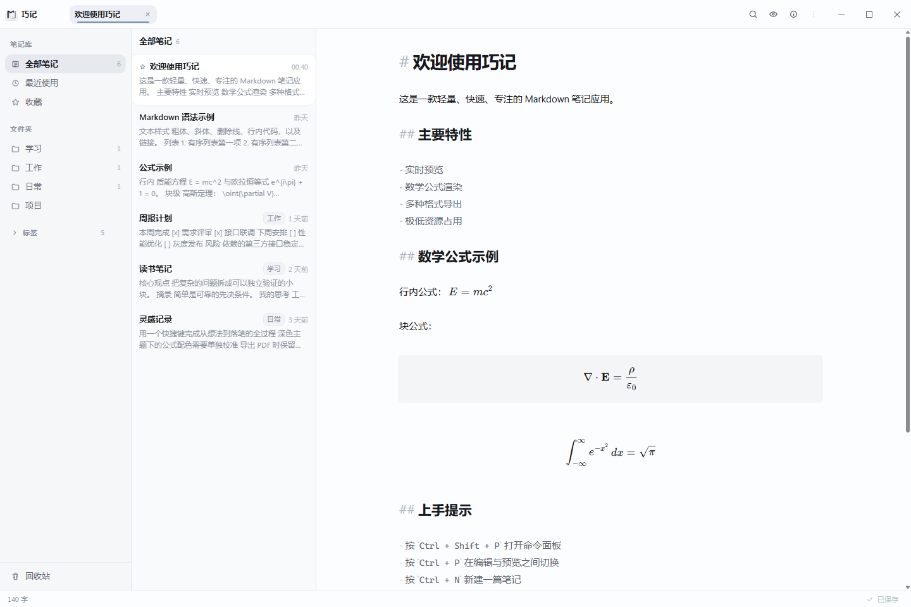
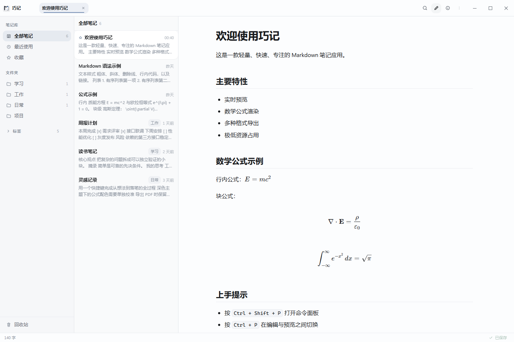
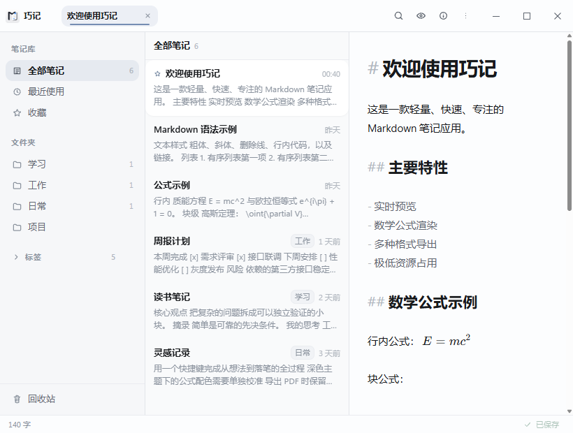
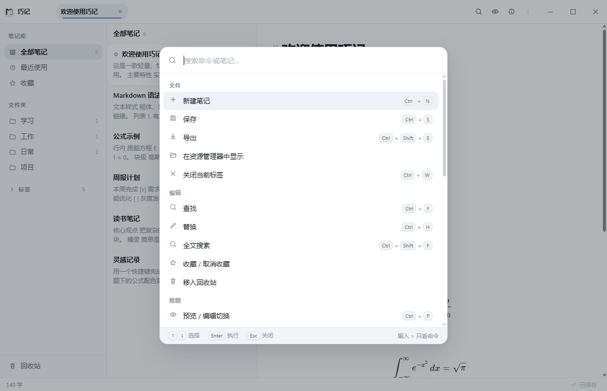
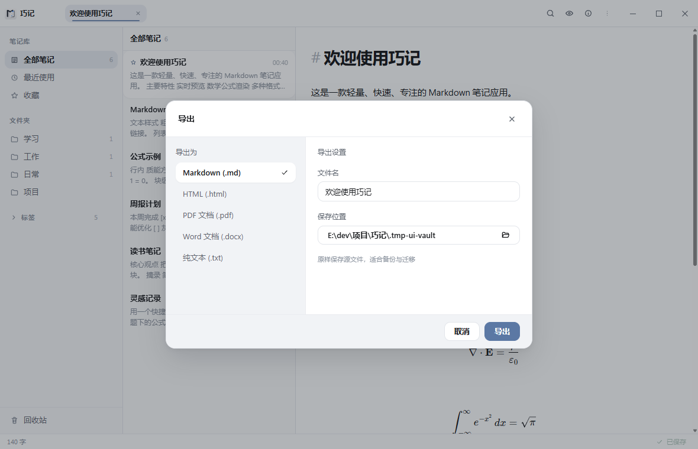

# 巧记

<p align="center">
  
</p>

<p align="center">
  A focused, local-first Markdown notebook for Windows.<br>
  Your notes stay as portable <code>.md</code> files on disk.
</p>

<p align="center">
  <a href="https://github.com/7788dev/qiaoji/releases"></a>
  <a href="https://github.com/7788dev/qiaoji/actions/workflows/release.yml"></a>
  <a href="https://github.com/7788dev/qiaoji/blob/main/LICENSE"></a>
</p>

<p align="center">
  <a href="#安装">安装</a> ·
  <a href="#快速开始">快速开始</a> ·
  <a href="#功能">功能</a> ·
  <a href="#数据与安全">数据与安全</a> ·
  <a href="#从源码构建">开发</a> ·
  <a href="#参与贡献">贡献</a>
</p>

<p align="center">
  <picture>
    <source media="(prefers-color-scheme: dark)" srcset="UI/screenshots/readme-dark.png">
    
  </picture>
</p>

<p align="center"><sub>真实运行界面 · 1440 × 960 · Windows WebView2</sub></p>

<p align="center">
  
  
</p>

<p align="center">
  
  
</p>

## 项目定位

巧记是一款 Windows-first 的本地 Markdown 笔记应用，面向需要快速记录、整理和长期保有数据的个人用户。
它把笔记保存为普通文件，把搜索和统计作为可重建的本地索引，因此不依赖云端账户，也不会把内容锁在专有数据库里。

## 安装

### Windows 安装包

1. 从 [Releases](https://github.com/7788dev/qiaoji/releases) 下载最新的 `Qiaoji-<version>-windows-amd64-setup.exe`。
2. 下载同一版本的 `SHA256SUMS.txt`，按下面的命令校验安装包。
3. 运行安装程序。安装范围默认为当前用户，不需要管理员权限。

```powershell
Get-FileHash .\Qiaoji-<version>-windows-amd64-setup.exe -Algorithm SHA256
Get-Content .\SHA256SUMS.txt
```

系统要求：

| 项目 | 要求 |
| --- | --- |
| 操作系统 | Windows 10 或 Windows 11，64 位 |
| WebView | [Microsoft Edge WebView2 Runtime](https://developer.microsoft.com/microsoft-edge/webview2/) |
| 安装权限 | 用户级安装不需要管理员权限 |

> 安装包目前未使用商业代码签名。请只从本仓库 Releases 下载，并在运行前核对 SHA-256。

## 快速开始

1. 启动巧记，在首次欢迎页确认或更改笔记库目录。
2. 按 `Ctrl + N` 创建笔记，输入 Markdown 内容。
3. 使用侧栏的文件夹、标签、收藏和最近使用组织内容。
4. 按 `Ctrl + Shift + F` 搜索整个笔记库。
5. 使用 `Ctrl + Shift + E` 将当前笔记导出为所需格式。

笔记库可以随时用资源管理器、Git 或其他编辑器打开；巧记不会阻止外部工具访问这些 `.md` 文件。

## 功能

### 编辑与预览

- CodeMirror 6 编辑器，支持 Markdown、代码块、任务清单、表格和快捷键。
- 编辑与渲染预览可一键切换，支持实时预览或手动刷新。
- KaTeX 渲染行内与块级数学公式。
- 代码高亮按语言按需加载，减少首屏负担。

### 组织与搜索

- 文件夹、标签、收藏、最近使用和回收站。
- SQLite FTS5 全文搜索，结果带上下文片段和高亮。
- 列表和网格视图、标题/创建时间/更新时间排序。
- 命令面板统一访问笔记操作、视图切换和设置。

### 文件与导出

- 粘贴或拖入 PNG、JPEG、GIF、WebP 图片，附件保存到笔记旁的 `assets/`。
- 导出 Markdown、HTML、PDF、Word 和纯文本。
- HTML/PDF 使用当前预览内容，PDF 通过应用内 WebView2 排版。
- 删除操作进入可恢复回收站，支持撤销；删除文件夹会同时保留其中附件。

### 可靠性与体验

- 自动保存带串行写入队列，不会让并发保存覆盖较新的编辑。
- 检测外部修改并进入冲突流程，避免静默覆盖磁盘版本。
- 文件夹重命名会保持当前筛选路径，非法或空名称会被拦截。
- 搜索索引、统计和诊断数据均为本地可重建缓存，不上传笔记内容。

## 数据与安全

巧记不要求登录，也不把笔记正文发送到网络服务。默认目录结构如下：

```text
%USERPROFILE%\Documents\巧记\       笔记库，可在设置中更改
├─ *.md                              Markdown 笔记
├─ <folder>\                         用户文件夹
├─ <note-folder>\assets\             笔记附件
└─ .qiaoji\
   ├─ trash\                         可恢复回收站
   ├─ vault.json                     笔记库初始化标记
   └─ ...                             应用内部临时数据

%APPDATA%\巧记\settings.json         窗口、主题和导出设置
```

每篇笔记使用 YAML front matter 保存 `id`、`title`、`tags`、`created`、`updated` 和 `favorite` 等元数据。
无法解析的 front matter 会拒绝写入，以保护原文件。搜索索引只服务于本地检索，删除后会自动重建。

## 快捷键

| 操作 | 快捷键 | 操作 | 快捷键 |
| --- | --- | --- | --- |
| 新建笔记 | `Ctrl + N` | 加粗 | `Ctrl + B` |
| 保存 | `Ctrl + S` | 斜体 | `Ctrl + I` |
| 导出 | `Ctrl + Shift + E` | 行内代码 | `Ctrl + E` |
| 关闭当前标签 | `Ctrl + W` | 插入链接 | `Ctrl + K` |
| 查找 / 替换 | `Ctrl + F` / `Ctrl + H` | 任务项 | `Ctrl + Shift + L` |
| 全文搜索 | `Ctrl + Shift + F` | 标题一至四级 | `Ctrl + 1` … `Ctrl + 4` |
| 命令面板 | `Ctrl + Shift + P` | 预览切换 | `Ctrl + P` |
| 设置 | `Ctrl + ,` | 侧边栏 | `Ctrl + \` |
| 快捷键一览 | `Ctrl + /` | | |

## 从源码构建

### 环境要求

- Go 1.25+
- Node.js 20.19+
- Wails v2.13.0
- Windows WebView2 Runtime
- NSIS（仅构建安装包时需要）

### 安装依赖

```powershell
go install github.com/wailsapp/wails/v2/cmd/wails@v2.13.0
Push-Location frontend
npm ci
Pop-Location
```

### 本地开发

```powershell
wails dev
```

### 质量检查

```powershell
go vet ./...
go test ./...
Push-Location frontend
npx tsc --noEmit
npm test
npm run build
Pop-Location
```

### 构建 Windows 安装包

```powershell
$env:CGO_ENABLED = "0"
wails build -platform windows/amd64 -nsis -installscope user -trimpath `
  -ldflags "-s -w -X qiaoji/internal/config.AppVersion=1.1.0"
```

输出位于 `build/bin/`。发布工作流会从 `vX.Y.Z` 标签读取版本、执行质量检查、生成安装包和 SHA-256 校验文件，并发布 GitHub Release。

## 项目结构

```text
.
├─ app.go, main.go, tray.go       Wails 应用壳与 Go 绑定
├─ internal/store/                Markdown vault、front matter、回收站
├─ internal/index/                SQLite FTS5 搜索索引与分页查询
├─ internal/exporter/             Markdown / HTML / PDF / DOCX / TXT 导出
├─ internal/watch/                文件变更监听与增量同步
├─ frontend/src/                  TypeScript UI、编辑器和交互逻辑
├─ frontend/wailsjs/              提交到仓库的生成绑定
├─ UI/screenshots/                README 与 UI 验收截图
└─ build/windows/                 Windows 图标、manifest 和 NSIS 配置
```

## 发布流程

发布由 `.github/workflows/release.yml` 驱动：

1. 创建并推送形如 `v1.2.3` 的版本标签。
2. GitHub Actions 使用 Go、Node.js 和 Wails 构建 Windows 用户级安装包。
3. 工作流运行 Go/TypeScript 质量门禁，生成 `SHA256SUMS.txt`。
4. 安装包和校验文件发布到 GitHub Release。

## 参与贡献

欢迎提交 Issue 和 Pull Request。提交前请：

1. 确认没有包含真实笔记、凭据、`node_modules` 或构建输出。
2. 为行为变化补充聚焦测试，尤其是 Windows 路径、回收站和外部修改场景。
3. 运行上面的质量检查，并在 PR 中说明用户可见变化和验证命令。
4. UI 改动请附带前后截图，并保持现有 Windows-first 交互和视觉语言。

## 许可证

[MIT License](LICENSE)

## 项目链接

- [最新 Release](https://github.com/7788dev/qiaoji/releases)
- [Issue tracker](https://github.com/7788dev/qiaoji/issues)
