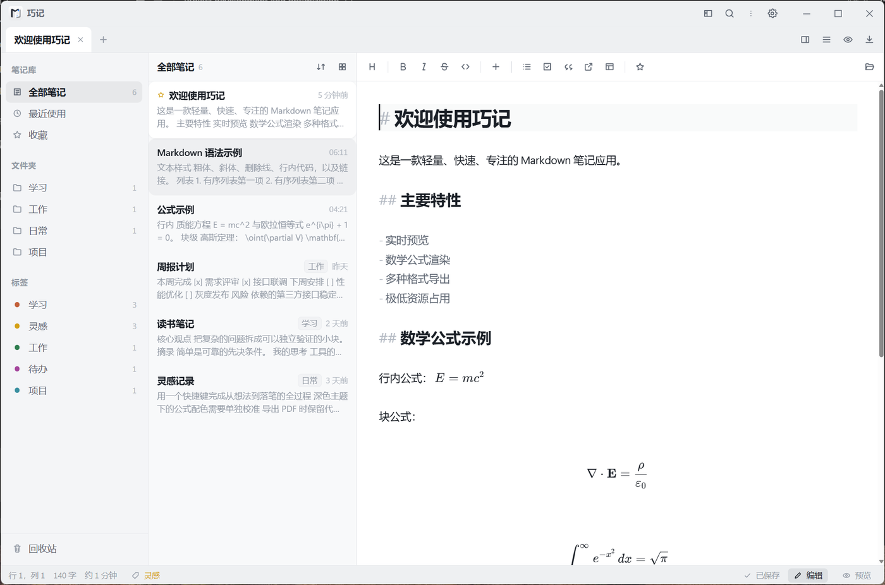
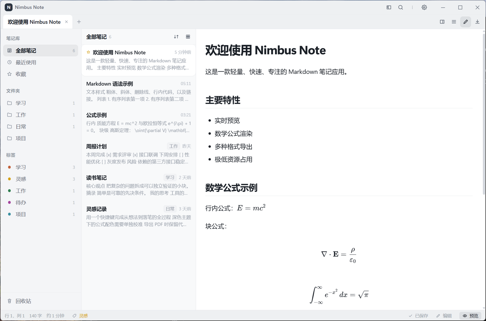
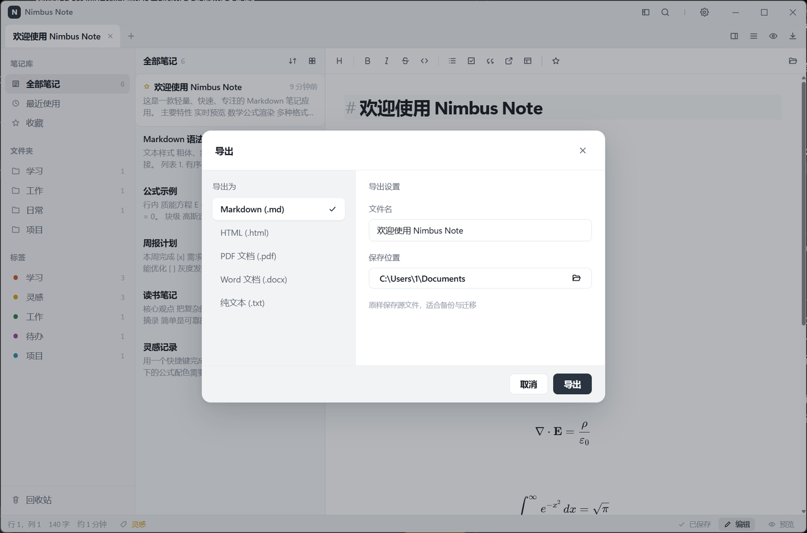
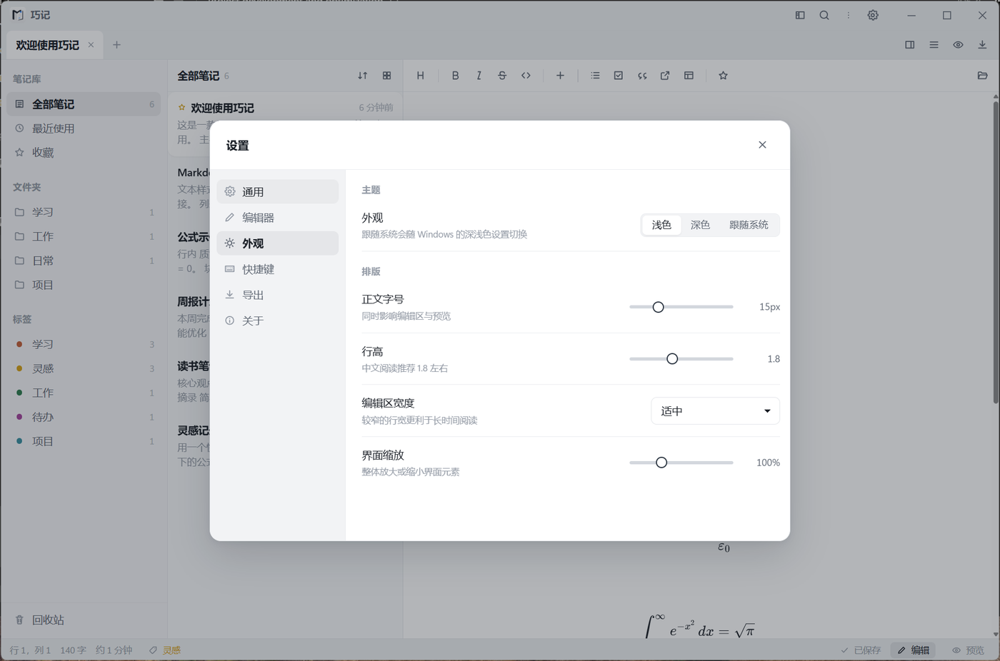

<p align="center">
  
</p>

<h1 align="center">巧记</h1>

<p align="center">
  本地优先的 Windows Markdown 笔记应用。<br>
  笔记就是磁盘上的 <code>.md</code> 文件：不锁定、可同步，卸载后数据仍在。
</p>

<p align="center">
  <a href="https://github.com/7788dev/qiaoji/releases/latest"></a>
  <a href="https://github.com/7788dev/qiaoji/releases/latest"></a>
  <a href="LICENSE"></a>
  <a href="https://github.com/7788dev/qiaoji/releases"></a>
</p>

<p align="center">
  <a href="#安装">安装</a> ·
  <a href="#特性">特性</a> ·
  <a href="#数据">数据</a> ·
  <a href="#快捷键">快捷键</a> ·
  <a href="#从源码构建">构建</a>
</p>

<p align="center">
  <picture>
    <source media="(prefers-color-scheme: dark)" srcset="UI/screenshots/main-dark.png">
    
  </picture>
</p>

<p align="center">
  
  
  
</p>

---

## 安装

从 [Releases](https://github.com/7788dev/qiaoji/releases/latest) 下载 `Qiaoji-<版本>-windows-amd64-setup.exe`。发布页附带 `SHA256SUMS.txt`，可用于校验文件完整性。

系统要求：Windows 10 / 11，已安装 [WebView2 运行时](https://developer.microsoft.com/microsoft-edge/webview2/)（系统通常已自带）。

> 安装包尚未使用商业代码签名。SmartScreen 可能提示「Windows 已保护你的电脑」。请只从本仓库 Releases 下载，核对 SHA-256 后，在提示中选择「更多信息」→「仍要运行」。

已安装的版本可在应用内 **设置 → 关于** 检查更新。版本号走国内 CDN 读取仓库中的 `version.json`；有新版本时可直接下载安装包并覆盖安装。

---

## 特性

- **本地优先** — 笔记以 Markdown 文件保存在你指定的目录，可用任意编辑器打开，也可丢进网盘或 Git。
- **实时编辑** — 标题按真实字号显示，语法标记保持可见可改；公式在编辑时即排版，光标移入还原为 TeX。
- **组织** — 文件夹、标签、收藏、最近使用、回收站；侧边栏与列表均可折叠。
- **搜索** — SQLite FTS5 全文检索，结果带高亮片段；`Ctrl + Shift + P` 同时搜命令与笔记。
- **公式与代码** — KaTeX 行内 / 块级公式；26 种语言按需高亮。
- **图片** — 粘贴截图或拖入 PNG / JPEG / GIF / WebP，文件落在笔记旁的 `assets/`。
- **导出** — Markdown、HTML、PDF、Word、纯文本。PDF 走应用内 WebView2 排版，与预览一致，无需安装 Edge。
- **模板** — 右键或工具栏可插入会议纪要、日报、周报、待办、读书笔记、技术方案。
- **体积** — 单个安装包约 19 MB，不内嵌 Chromium。

---

## 数据

```
%USERPROFILE%\Documents\巧记\     笔记库（可在设置中更改）
├─ 工作\  学习\  项目\  日常\
├─ 欢迎使用巧记.md
└─ .qiaoji\
   ├─ index.db                   搜索索引（可删，下次启动重建）
   ├─ vault.json                 初始化标记
   └─ trash\                     回收站

%APPDATA%\巧记\settings.json     窗口、主题、导出路径等
```

每篇笔记的元数据写在 YAML front matter 中。巧记只维护 `id`、`title`、`tags`、`created`、`updated`、`favorite`；其它字段（例如 Obsidian 的 `aliases`）会原样保留。front matter 无法解析时会拒绝写入，而不是覆盖原文件。

删除单篇笔记会移入 `.qiaoji/trash`；删除文件夹会连同其中的图片和附件一起进入回收站。同目录 `assets/` 中被多篇笔记引用的图片不会随单篇删除自动清除。

首次打开某个笔记库会写入示例笔记，并留下 `vault.json`。把示例全部删掉后不会再自动塞回；若要重新生成，删除该标记文件即可。

---

## 快捷键

| 操作 | 快捷键 | 操作 | 快捷键 |
| --- | --- | --- | --- |
| 新建笔记 | `Ctrl + N` | 加粗 | `Ctrl + B` |
| 保存 | `Ctrl + S` | 斜体 | `Ctrl + I` |
| 导出 | `Ctrl + Shift + E` | 行内代码 | `Ctrl + E` |
| 关闭标签 | `Ctrl + W` | 插入链接 | `Ctrl + K` |
| 查找 / 替换 | `Ctrl + F` / `H` | 任务项 | `Ctrl + Shift + L` |
| 全文搜索 | `Ctrl + Shift + F` | 一至四级标题 | `Ctrl + 1` … `4` |
| 命令面板 | `Ctrl + Shift + P` | 预览 | `Ctrl + P` |
| 设置 | `Ctrl + ,` | 侧边栏 | `Ctrl + \` |
| 快捷键一览 | `Ctrl + /` | | |

---

## 从源码构建

需要 Go 1.25+、Node 20.19+、[Wails v2.13.0](https://wails.io) 与 NSIS。请锁定 Wails 版本：Go 1.25 默认输出 DWARF5，旧版 Wails 在 Windows 上无法生成绑定工具。

```powershell
go install github.com/wailsapp/wails/v2/cmd/wails@v2.13.0

# 开发
wails dev

# 安装包 → build/bin/Qiaoji-<版本>-windows-amd64-setup.exe
$env:CGO_ENABLED = "0"
wails build -platform windows/amd64 -nsis -installscope user -trimpath `
  -ldflags "-s -w -X qiaoji/internal/config.AppVersion=1.0.1"
```

```powershell
go vet ./...
go test ./...
Push-Location frontend
npm ci
npx tsc --noEmit
npm test
Pop-Location
```

发新版时先把 `version.json` 里的 `version`、`installer` 和 `sha256` 改成与新安装包一致，再打 `vX.Y.Z` 标签。应用内检查更新会通过国内 CDN 读取该文件。

升级 KaTeX 后执行 `go run ./tools/genkatex`。更换图标后执行 `python tools/genicon.py`（输入为 `UI/brand/icon-source.png`）。

Windows 后端为纯 Go（WebView2 COM + `modernc.org/sqlite`），因此发布构建使用 `CGO_ENABLED=0`。

---

## 技术栈

| | |
| --- | --- |
| 运行时 | Go 1.25、Wails v2.13、系统 WebView2 |
| 前端 | TypeScript、CodeMirror 6、KaTeX、Vite |
| 数据 | 本地 `.md` + YAML front matter；SQLite FTS5 仅作索引 |
| 导出 | 自包含 HTML、WebView2 PDF、手写 OOXML（Word） |

---

## 许可

[MIT](LICENSE)
