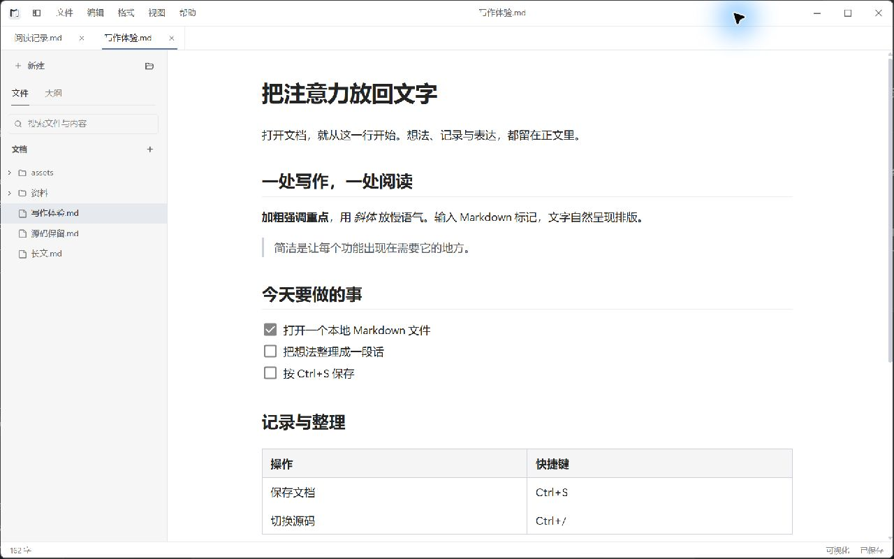

<p align="center">
  
</p>

<h1 align="center">巧记</h1>

<p align="center">面向 Windows 的本地 Markdown 编辑器。打开文件，就能写。</p>

<p align="center">
  <a href="https://github.com/7788dev/qiaoji/releases/latest"></a>
  <a href="https://github.com/7788dev/qiaoji/actions/workflows/release.yml"></a>
  <a href="LICENSE"></a>
</p>

<p align="center">
  <a href="https://github.com/7788dev/qiaoji/releases/latest">下载</a> ·
  <a href="docs/guide.md">使用指南</a> ·
  <a href="docs/screenshots.md">界面预览</a> ·
  <a href="CHANGELOG.md">更新日志</a> ·
  <a href="CONTRIBUTING.md">参与贡献</a>
</p>

<p align="center">
  <picture>
    <source media="(prefers-color-scheme: dark)" srcset="UI/screenshots/writing-dark-1280x800.jpg">
    
  </picture>
</p>

<p align="center"><sub>Windows 实际运行界面 · 100% 应用缩放 · 16px 正文</sub></p>

## 安装

从 [GitHub Releases](https://github.com/7788dev/qiaoji/releases/latest) 下载 `Qiaoji-<版本>-windows-amd64-setup.exe` 并运行。默认安装到当前用户，无需管理员权限。

支持 **Windows 10 / 11（64 位）**，需要 [WebView2 Runtime](https://developer.microsoft.com/microsoft-edge/webview2/)。每个版本附带 `SHA256SUMS.txt`，可用 PowerShell 的 `Get-FileHash <安装包路径> -Algorithm SHA256` 核对。

## 功能

- **直接写作**：标题、列表、任务项、表格、代码和公式在正文中呈现；随时切换完整 Markdown 源码。
- **本地文件**：新建草稿，打开任意位置的 `.md` 文件或文件夹，无需导入笔记库。
- **手动保存**：`Ctrl+S` 写入磁盘；关闭前确认未保存修改，外部修改冲突保留编辑内容。
- **轻量导航**：文件树与大纲共用侧栏，支持全文搜索、查找替换和多标签；每篇文档保留独立撤销记录。
- **图片与导出**：粘贴图片随保存写入 `assets/`；支持 HTML、PDF、Word、纯文本导出和 Markdown 另存为。
- **阅读排版**：深浅主题、可调字号与正文宽度；窄窗口使用抽屉侧栏。

## 快速开始

1. 启动后直接输入，按 `Ctrl+S` 选择文件位置。
2. 按 `Ctrl+O` 打开文件，或用 `Ctrl+Shift+O` 浏览文件夹。
3. 按 `Ctrl+/` 切换可视化与源码；格式操作在顶部「格式」菜单中。

默认手动保存。切换标签、编辑模式或窗口焦点不会保存文件。下次启动恢复已保存文档、当前标签和阅读位置。

完整快捷键、图片处理和冲突处理见 [使用指南](docs/guide.md)。

## 文件兼容

文档始终是普通 Markdown 文件。巧记不自动添加元数据，也不根据标题重命名文件；已有 front matter 会保留。仅打开、切换模式或无修改保存不会重写文件。

实际进行可视化编辑后，正文可能规范化为等价 Markdown。原始 HTML 和不能可靠转换的语法使用源码模式保留。旧版笔记、附件和回收站仍可使用。

偏好与搜索缓存位于 `%APPDATA%\巧记`。打开文件夹不会生成示例文件；图片和回收站按需创建在文档所在目录。详见 [文件与数据](docs/guide.md#文件与数据)。

## 开发

使用 Go **1.25.13+**、Node.js **20.19+** 和 Wails **2.13.0**。

```powershell
go install github.com/wailsapp/wails/v2/cmd/wails@v2.13.0
Push-Location frontend
npm ci
Pop-Location
wails dev
```

编辑器基于 [Milkdown Crepe](https://milkdown.dev/) 7.22.1 和 [CodeMirror](https://codemirror.net/) 6，桌面运行时使用 [Wails](https://wails.io/)。项目结构、测试和安装包构建见 [贡献指南](CONTRIBUTING.md)；发布步骤见 [发布指南](docs/releasing.md)。

问题反馈请提交 [Issue](https://github.com/7788dev/qiaoji/issues)，附上版本、复现步骤和不含个人数据的示例。界面改动与回归验证记录见 [写作体验验收](docs/writing-experience-acceptance.md)。

## 许可证

[MIT](LICENSE)
