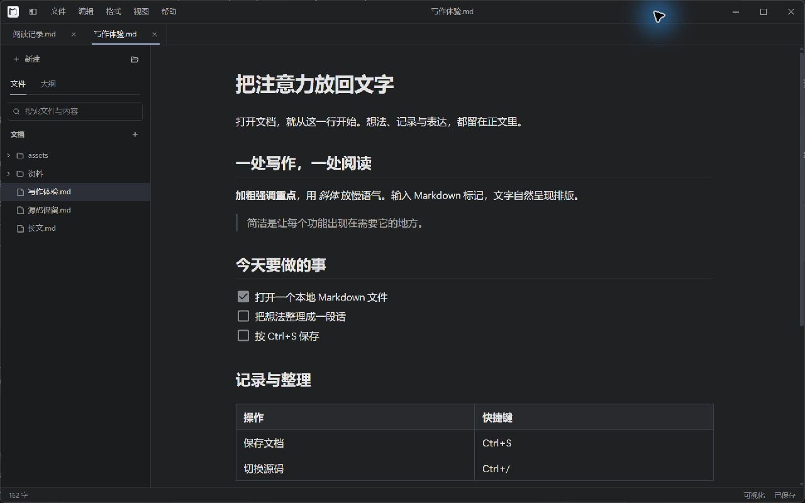
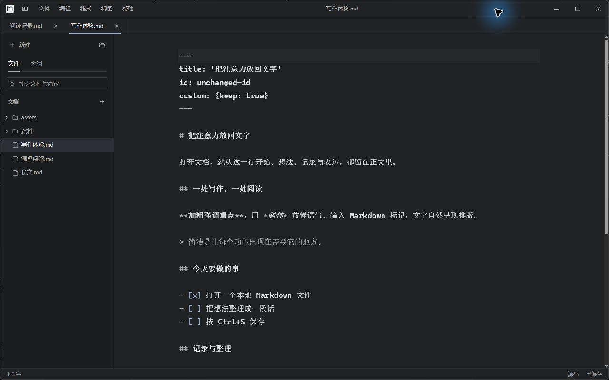
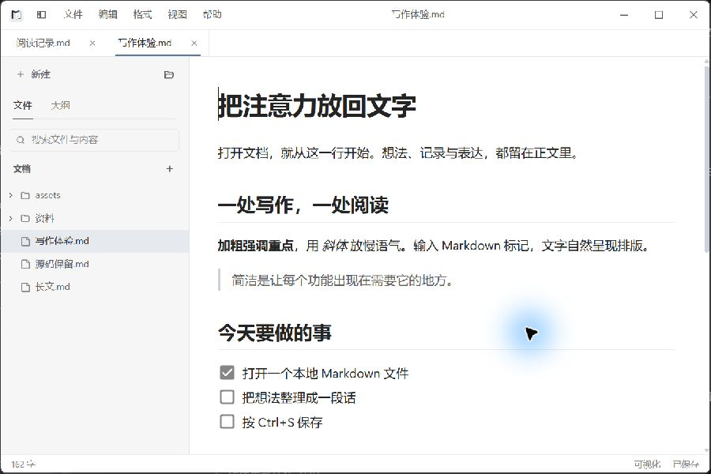

# 界面预览

[返回首页](../README.md) · [使用指南](guide.md)

以下均为 Windows WebView2 实际运行截图，正文为演示内容。默认使用 100% 应用缩放、16px 正文字号；点击图片可查看原图。

## 浅色写作界面

文件树与正文共用一个窗口，多篇文档通过顶部标签切换。

## 深色写作界面

深色主题同时适用于菜单、文件树、表格和正文。

## 完整源码

使用 `Ctrl+/` 编辑完整文件，包括 front matter。切换模式不会自动保存。

## 小窗口

900 × 600 窗口保持紧凑导航；有效空间继续缩小时，侧栏改为抽屉。

缩放、抽屉、关闭确认及改版前后对照见 [验收记录](writing-experience-acceptance.md#截图)。
