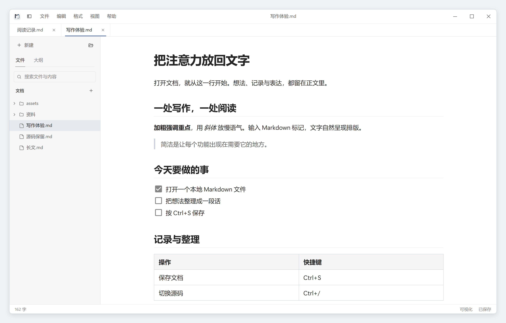
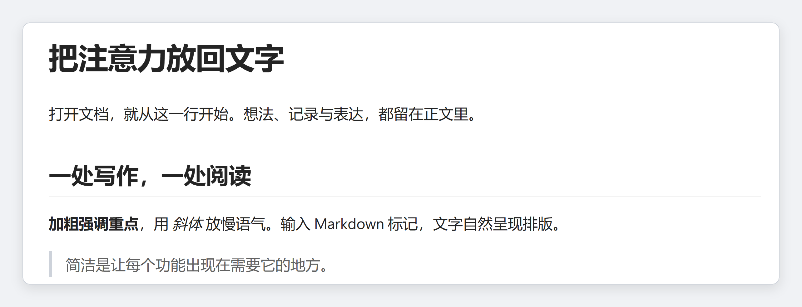
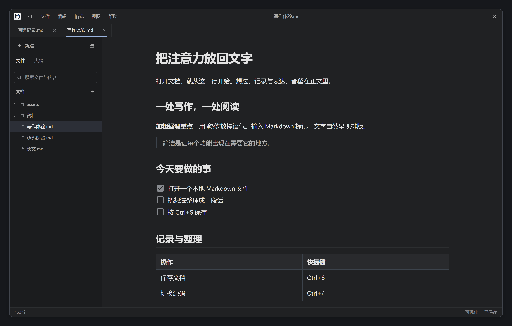
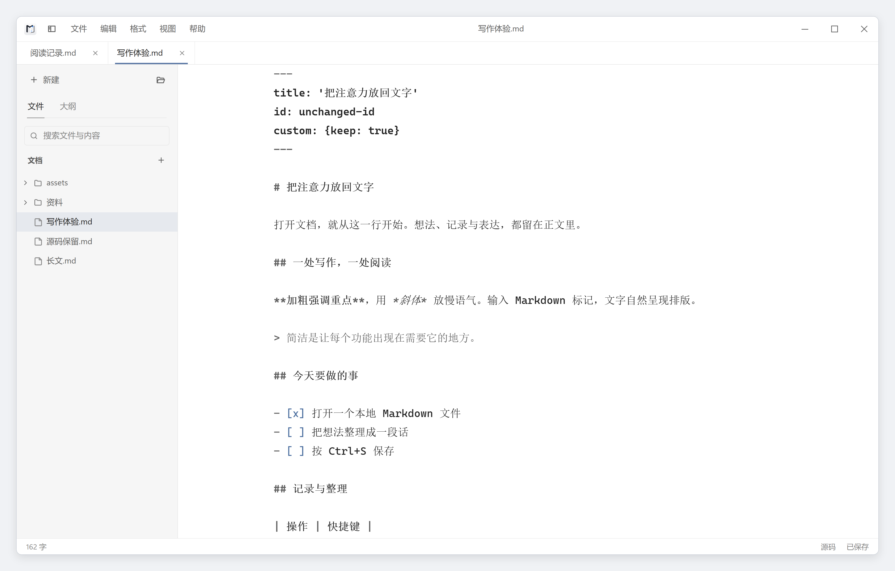
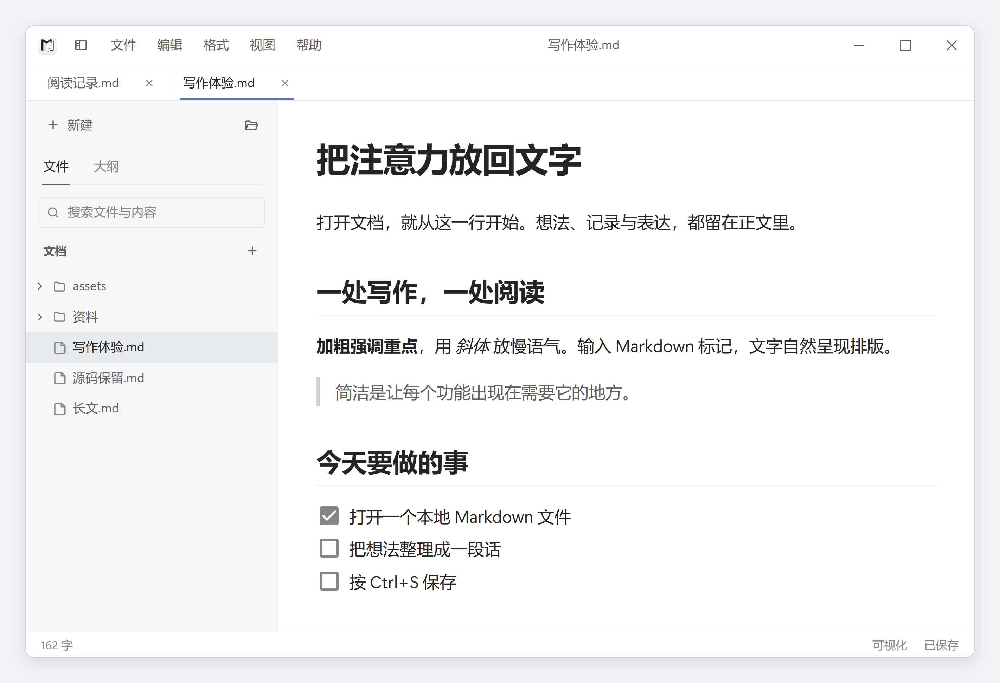

# 界面预览

[返回首页](../README.md) · [使用指南](guide.md)

以下为当前版本的实际界面，正文为演示内容。使用 100% 应用缩放、16px 正文字号；每张图片独立展示，点击可查看无损 PNG 原图。

## 浅色写作界面

文件树与正文共用一个窗口，多篇文档通过顶部标签切换。

## 正文细节

从同一张原图裁取标题、段落和引用，便于查看中文笔画、字重与行间距。

## 深色写作界面

深色主题同时适用于菜单、文件树、表格和正文。

## 完整源码

使用 `Ctrl+/` 编辑完整文件，包括 front matter。切换模式不会自动保存。

## 小窗口

900 × 600 窗口保持紧凑导航；有效空间继续缩小时，侧栏改为抽屉。

截图按 3 倍像素采集，统一细边框与留白。采集环境、原始尺寸、缩放与改版前后对照见 [验收记录](writing-experience-acceptance.md#截图)。
